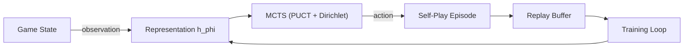
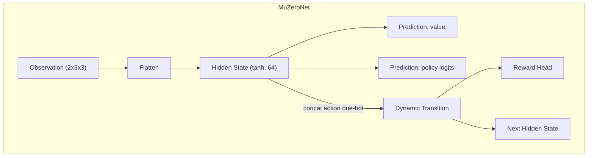

# MuZero for Tic-Tac-Toe

This project implements a compact MuZero agent that learns to play Tic-Tac-Toe via self-play and Monte Carlo Tree Search. After training, the agent becomes unbeaten by a strong rule-based opponent (0 losses over 80 evaluation games) while keeping the neural networks lightweight for quick iteration on a MacBook Pro (utilising Metal Performance Shaders when available).

## Quick Start

```bash
python -m venv .venv
source .venv/bin/activate
pip install torch numpy
python src/train.py --loops 12 --evaluation-games 20 --checkpoint muzero_checkpoint.pt
```

The default configuration performs 80 MCTS simulations per move and 12 training loops (10 self-play games and 240 optimisation steps per loop). Adjust `--loops`, `--evaluation-games`, and `--checkpoint` as required. The agent auto-selects `mps`, `cuda`, or CPU.

Evaluate a trained checkpoint (defaults to `muzero_checkpoint.pt`):

```bash
python src/evaluate.py --games 80
```

## Project Layout

| Path | Description |
| --- | --- |
| `src/muzero_ttt/config.py` | Hyperparameters (`MuZeroConfig`) controlling search, optimisation, and device selection. |
| `src/muzero_ttt/game.py` | Deterministic Tic-Tac-Toe environment (`TicTacToe`) with observation encoding and win detection. |
| `src/muzero_ttt/rule_based.py` | Heuristic opponent (`RuleBasedAgent`) that plays optimal centre/edge/blocking strategy. |
| `src/muzero_ttt/network.py` | Tiny PyTorch model (`MuZeroNet`) implementing representation, dynamics, and prediction heads plus `NetworkOutput`. |
| `src/muzero_ttt/mcts.py` | MuZero-specific MCTS (`MCTS`, `Node`) with Dirichlet exploration and MinMax normalisation. |
| `src/muzero_ttt/mu_algorithm.py` | Training loop (`MuZeroAgent`), replay buffer, targets, and evaluation vs the rule-based benchmark. |
| `src/muzero_ttt/utils.py` | Device selection and reproducible seeding helpers. |
| `src/train.py` | Command-line training driver (loops of self-play → optimisation → evaluation). |
| `src/evaluate.py` | Standalone evaluation utility for checkpoints. |
| `muzero_checkpoint.pt` | Pretrained weights from the unbeaten run (0 losses / 80 games). |

## How the Pieces Fit





### Key Classes & Functions

- `TicTacToe`
  - `observation()` encodes the board from the current player’s perspective as two binary planes.
  - `legal_actions()`, `apply(action)`, and `outcome()` manage move legality, terminal rewards, and winners.
- `RuleBasedAgent`
  - `select_action(game)` plays immediate wins, blocks opponent forks, chooses centre, then corners.
- `MuZeroNet`
  - `initial_inference(obs)` → hidden state, value, policy for the root observation.
  - `recurrent_inference(hidden, action)` → next hidden state, reward, value, and policy after simulating an action.
- `MCTS`
  - `run(game, add_exploration_noise)` expands a search tree with PUCT, Dirichlet noise at the root, and uses true environment rewards for edge statistics.
  - `Node` stores hidden states, priors, statistics, and clones of intermediate game states for legal move masking.
- `MuZeroAgent`
  - `self_play(num_games)` generates episodes by sampling from visit-count distributions (higher temperature only on early moves).
  - `train(num_steps)` optimises value (MSE), reward (MSE), and policy (cross-entropy) targets from sampled replay segments.
  - `evaluate_vs_rule_based(num_games)` plays deterministic matches (temperature=0, no Dirichlet noise) against the heuristic opponent.
  - `save(path)` / `load(path)` serialise checkpoints (used by `train.py` and `evaluate.py`).
- `train.py`
  - CLI flags: `--loops`, `--evaluation-games`, `--checkpoint`, `--load-checkpoint`, and `--stop-on-flawless`.
  - Prints JSON summaries per loop (metrics + evaluation), and stops early when the evaluation has zero losses if requested.
- `evaluate.py`
  - Loads a checkpoint and reports JSON win/loss/draw counts over the requested number of games.

## Results

Training with the default configuration (`python src/train.py --loops 12 --evaluation-games 20 --checkpoint muzero_checkpoint.pt`) converged to an agent that draws every game against the rule-based benchmark:

```
{
  "games": 80,
  "results": {"wins": 0, "losses": 0, "draws": 80}
}
```

The replay buffer stores 10,000+ positions over the run, but the networks stay compact (≈330 KB checkpoint) enabling quick experimentation on a laptop.

## Notes

- The agent auto-detects the best available device: `mps` (Apple Silicon) → `cuda` → CPU.
- Search uses true environment rewards for edge values while the reward head is still trained to match them, keeping MuZero’s model-based nature but stabilising search on terminal moves.
- You can edit `MuZeroConfig` to explore alternative horizons, batch sizes, or exploration schedules; the training CLI options override only the loop counts and checkpoints.
